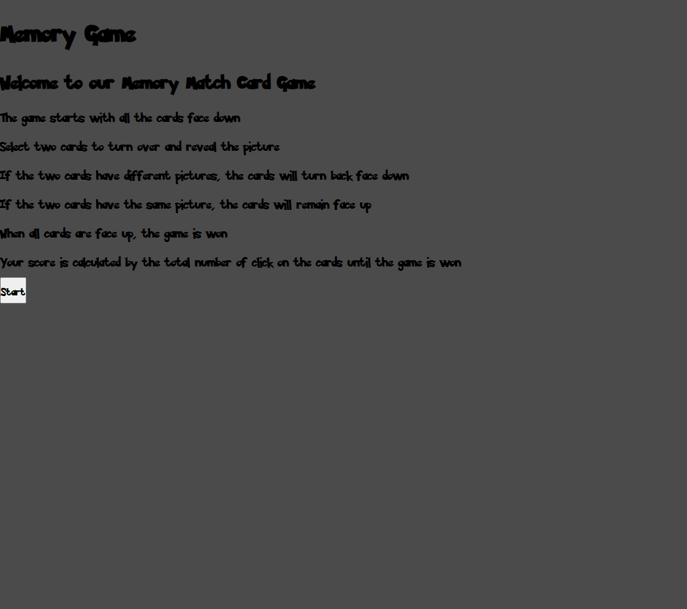
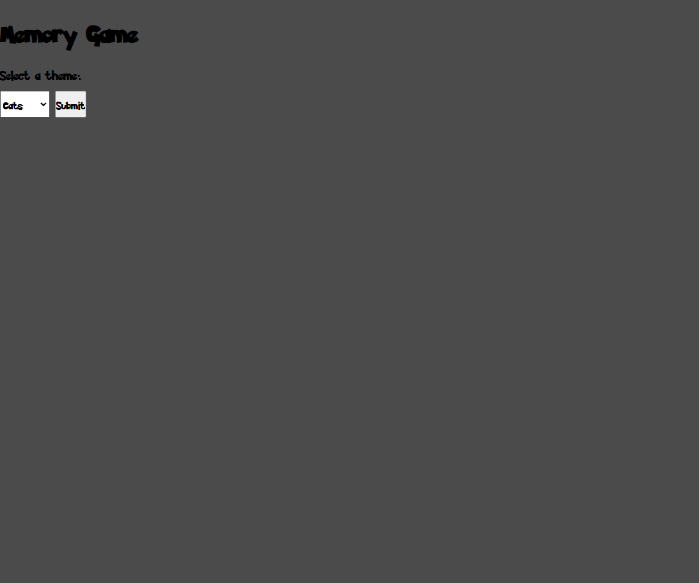
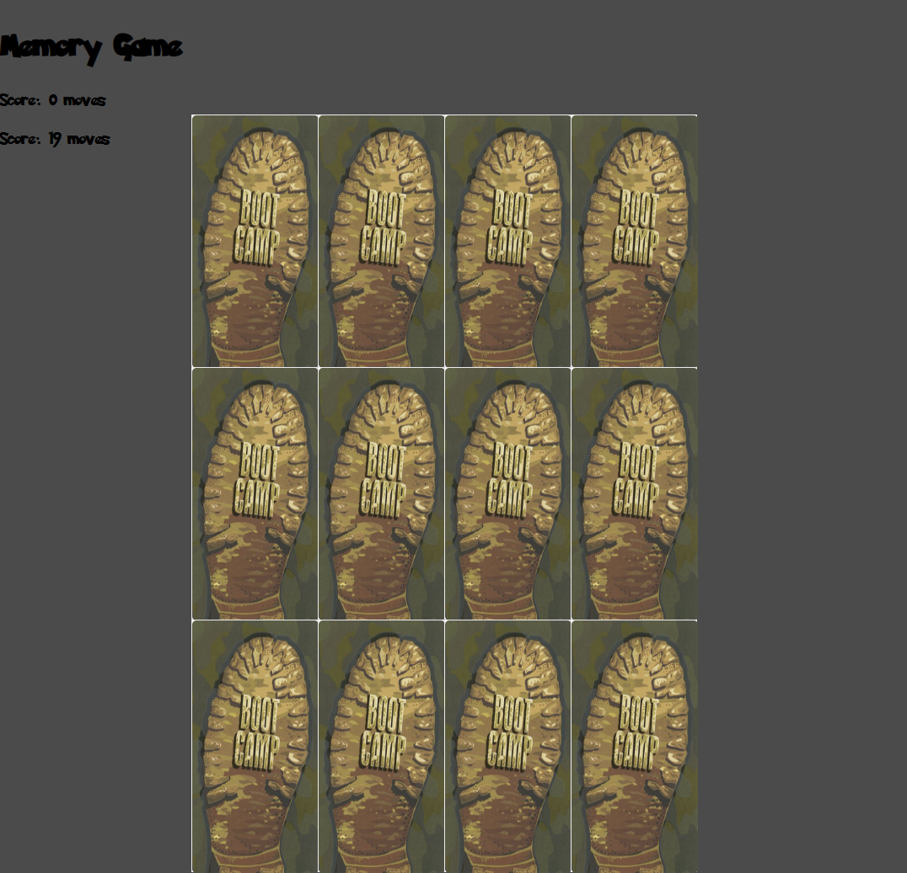
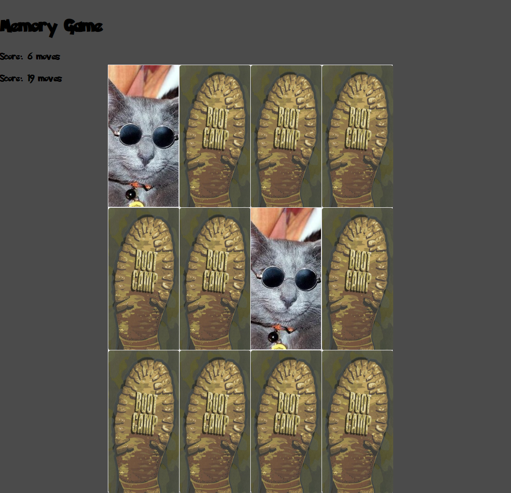
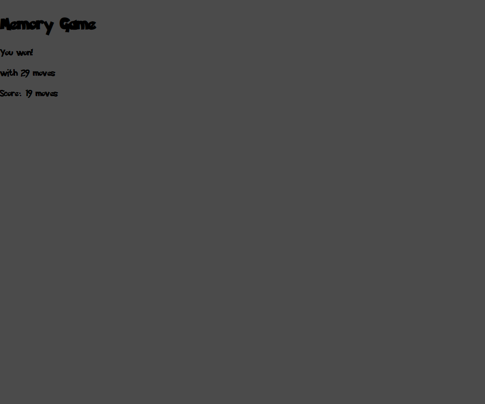

# Memory-Game
Group Project #1

## Description
This project was created to recreate a common childhood game were the game starts with the cards faced down and are revealed when two are selected. If the two cards are not matching, they will turn back face down, but if there is a match the cards will remain faced up. You won the game when all cards are facing up and the score is calculated by the total number of clicks.

## How to play
End user opens the website and is presented with the welcome page with the instructions and the user clicks start game.

You are then prompted to select a theme for the game. After selecting the theme the user clicks "go"

The next page will display twelve blank cards and a move counter that acts as a top score. 

When matching two cards they will lock into place as you proceed to find all matches. If two cards don't match they will revert back to the original state of the card.

The game ends when all cards are matching and you score is displayed with the top score below it. 

## API Sources:
https://pokeapi.co/
https://pokeapi.co/docs/v2#berries-section

https://docs.thecatapi.com/
https://developers.thecatapi.com/view-account/ylX4blBYT9FaoVd6OhvR?report=bOoHBz-8t

## Future Updates
In the future we plan to add a "Play Again Button", add a time limit on the cards when there has not been any activity, add more themes and add a difficlty level to the game.

## Contributors
Our team consisted of Chelsea Ballinger and Arnold Sanchez.

## Link
https://arniezzy.github.io/Memory-Game/
